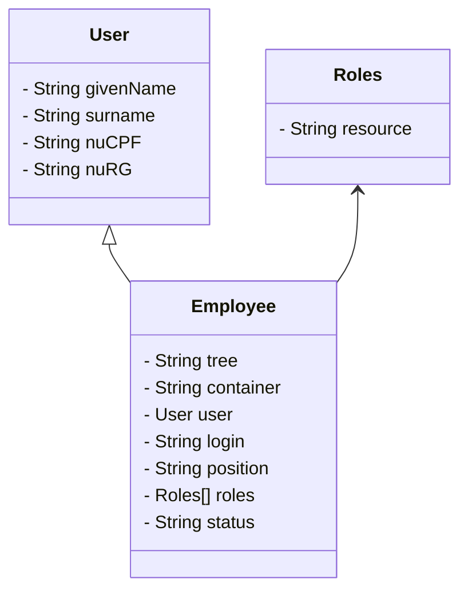

## User Controller API

```mermaid
classDiagram
    class User {
        - String givenName
        - String surname
        - String nuCPF
        - String nuRG
    }
    class Roles {
        - String resource
    }
    class Employee {
        - String tree
        - String container
        - User user
        - String login
        - String position
        - Roles[] roles
        - String status
    }

    User <|-- Employee
    Roles <-- Employee

```
